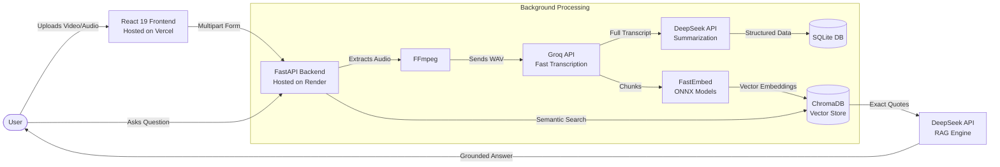

<div align="center">
  
  
  # VoxLens — AI Meeting Intelligence
  
  **Transform raw meeting recordings into structured, interactive intelligence in seconds.**

  [](https://reactjs.org/)
  [](https://fastapi.tiangolo.com/)
  [](https://www.typescriptlang.org/)
  [](https://python.org)
  [](https://www.trychroma.com/)
</div>

<br/>

VoxLens is an enterprise-grade AI platform that ingests raw audio/video recordings, transcribes them using **Groq LPUs**, extracts actionable insights using **DeepSeek AI**, and allows you to chat interactively with your meetings using mathematically grounded **Retrieval-Augmented Generation (RAG)**.

## ✨ Key Features

- **🚀 Lightning-Fast Processing:** Utilizes Groq LPUs for near-instant transcription of hour-long meetings.
- **🧠 Deep Reasoning:** Uses DeepSeek to intelligently extract summaries, action items, decisions, and open questions.
- **💬 Zero-Hallucination Chat:** Talk to your meetings! We use ChromaDB and semantic search to ground all AI answers strictly in the transcript.
- **💅 Premium UI:** Built with React 19 and Framer Motion for a stunning, responsive, dark-mode-first aesthetic.
- **☁️ Cloud-Optimized:** Designed to run blazingly fast even on highly restricted, low-memory (512MB RAM) cloud tiers.

---

## 🏗️ Cloud Architecture

The platform is designed to be highly resilient, asynchronous, and scalable.



---

## 💻 Tech Stack Breakdown

### The Frontend (Vercel)
- **React 19 + TypeScript:** The latest React primitives for flawless rendering.
- **Vite:** Blazing-fast development environment and optimized production builds.
- **Framer Motion:** High-performance micro-animations for a fluid user experience.
- **Zustand + TanStack Query:** State management and asynchronous data fetching.

### The Backend (Render)
- **FastAPI (Python):** Handles incoming HTTP requests and background task orchestration natively, completely eliminating the need for heavy external queues like Celery or Redis.
- **FFmpeg:** Automatically standardizes all uploaded media into optimal 16kHz mono audio.
- **FastEmbed (ONNX):** We explicitly avoided heavy PyTorch dependencies. FastEmbed runs natively in C++/Rust, calculating mathematical vectors using only a tiny fraction of RAM (~150MB), perfectly fitting Render's free-tier constraints.
- **ChromaDB:** Local vector database powering the Semantic Search engine.

---

## 🚀 Getting Started Locally

To run this architecture on your local machine, follow these steps:

### Prerequisites
- Python 3.12+
- Node.js 20+
- FFmpeg installed and available in your system's PATH.

### 1. Start the Backend
Navigate to the backend directory, install dependencies, and start the FastAPI server:
```bash
cd backend
python -m venv venv
source venv/bin/activate  # On Windows use: .\venv\Scripts\activate
pip install -r requirements.txt
uvicorn app.main:app --host 127.0.0.1 --port 8000
```

### 2. Connect the Frontend
In a new terminal window, navigate to the frontend directory and start the Vite development server:
```bash
cd frontend
npm install
npm run dev
```
*(By default, the Vite proxy will automatically route `/api` requests to your local backend on port `8000`.)*

---

## 🛡️ RAG (Retrieval-Augmented Generation)

We ensure that VoxLens **never hallucinates** when you ask a question about your meeting. 
1. When a question is asked, `FastEmbed` mathematically converts the question into a vector.
2. We query `ChromaDB` for the top 5 most mathematically similar moments in the transcript.
3. We inject ONLY those exact, factual quotes into the prompt for the `DeepSeek` AI.
4. DeepSeek answers your question and provides clickable citations pointing exactly to where it found the information.

---

<div align="center">
  <i>Engineered for peak performance. Built for the modern enterprise.</i>
</div>
